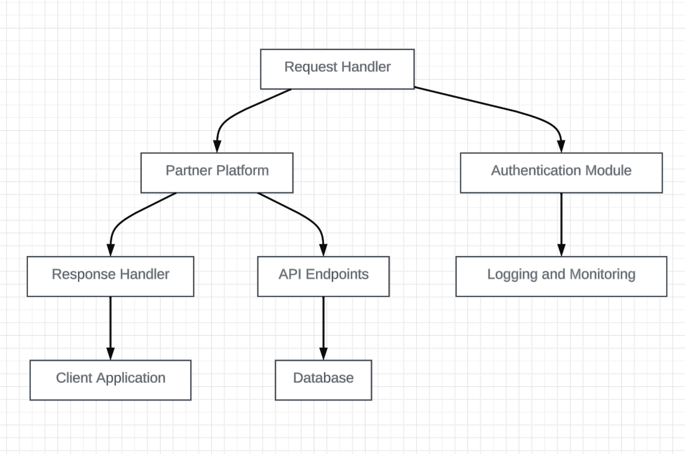

# Middleware-Bridge-ASPNet
## Overview
This repository contains the code for a middleware application developed in ASP.Net. The application serves as a bridge between TazWorks and SmartRecruiters platforms, connecting a software application to a partner's platform using Restful API.



## Features
- Seamless Integration: Facilitates smooth communication between two platforms.
- RESTful API Support: Utilizes RESTful API principles for interoperability.
- Scalable Architecture: Designed with scalability in mind to handle varying workloads.
- Secure Communication: Implements security measures to ensure safe data transmission.

## Prerequisites
.NET Core 3.1 or higher
Visual Studio 2019 or compatible IDE

## Installation
1. Clone the repository:
```
git clone git@github.com:aaronksalmon/Middleware-Bridge-ASPNet.git
```
2. Navigate to the project directory:
```
cd Middleware-Bridge-ASPNet
```
3. Restore the required packages:
```
dotnet restore
```
4. Build and run the application:
```
dotnet build
dotnet run
```

## Usage
The application can be configured to connect to specific platforms by modifying the configuration files. Detailed instructions on connecting to different platforms can be found in the docs folder.

## Documentation
Comprehensive documentation is available in the docs directory, including guides on:

- Configuring the application
- Extending functionality
- Troubleshooting common issues

## License
This project is licensed under the MIT License. See the LICENSE.md file for details.

## Support
For support, questions, or issues, please contact me (aaronkempfsalmon@gmail.com) or open an issue on GitHub.
